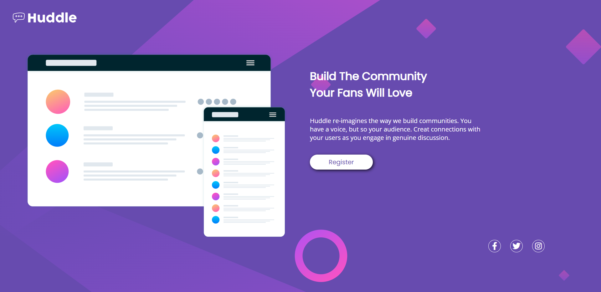

# Frontend Mentor - Huddle landing page with single introductory section solution

This is a solution to the [Huddle landing page with single introductory section challenge on Frontend Mentor](https://www.frontendmentor.io/challenges/huddle-landing-page-with-a-single-introductory-section-B_2Wvxgi0). Frontend Mentor challenges help you improve your coding skills by building realistic projects. 

### O desafio

Usuários devem ser capazes de: 

- Visualizar o layout ideal para a página, de acordo com o tamanho da tela do seu dispositivo.
- Ver as características de hover para todos os elementos que o possuem.

### Screenshot

### Links

- Solution URL: https://github.com/rafa210488/Quest-Huddle
- Live Site URL: https://rafa210488.github.io/Quest-Huddle/

### Criado com

- HTML5 semântico
- CSS Grid e Flexbox

### O que aprendi?

Este desafio, mesmo simples me ensinou bastante sobre as possibilidades do uso de CSS Grid e Flexbox. Realizei algumas mudanças durante o processo para me aproximar do resultado final de forma mais satisfatória.
Outro aprendizado foi o de que várias soluções são possíveis para se resolver um problema, e que se algo não esta funcionando corretamente no momento, podemos deixar de lado, resolver de outra forma, e aprender um pouco mais depois e usar esses aprendizados em projetos futuros.

### Conceitos em desenvolvimento

Como dito no item anterior, algumas dificuldades surgiram em relação ao posicionamento do grid principalmente, então o CSS Grid é um tema que vou procurar praticar mais a fundo, criando novos projetos e desafios para conseguir internalizar melhor o conceito.

## Autor

- Linkedin - https://www.linkedin.com/in/rafaelrdossantos/
- Github - https://github.com/rafa210488
- Instagram - https://www.instagram.com/rafael210488/

## Agradecimentos

Quero aqui agradecer a toda a equipe do curso DevQuest, que solicitaram este desafio como parte do curso, e também a própria comunidade do curso, que esta sempre se ajudando, criando um ambiente de aprendizado contínuo, e de muito respeito e inclusão, algo importante para pessoas que como eu estão em um processo de mudança de carreira.

